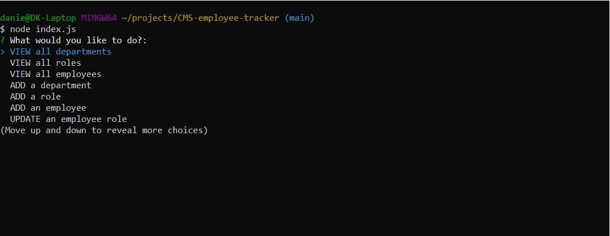
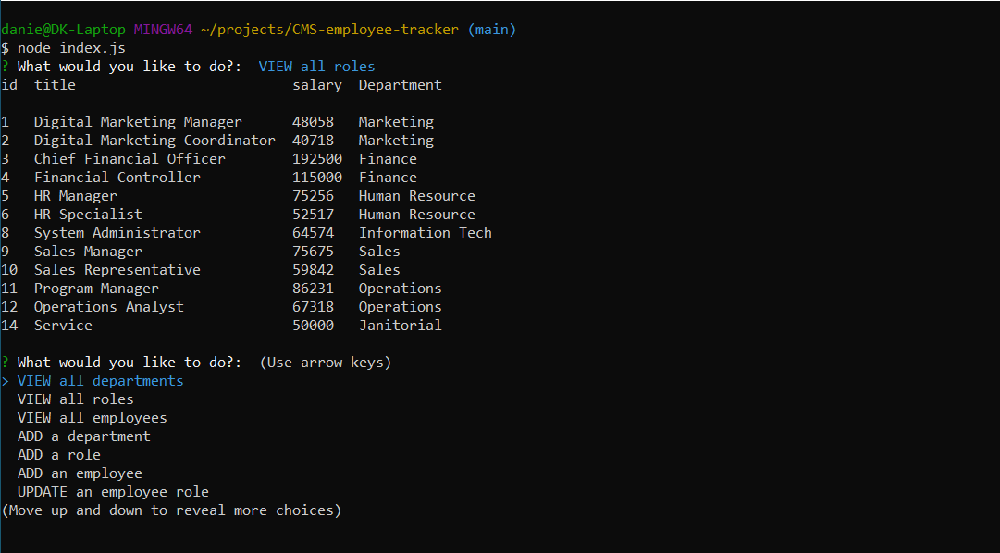

 # CMS Employee Tracker

  [](https://opensource.org/licenses/MIT)

  ## Description

  A Content Management System app that utilizes MySQL database and Node to view and update information. In every large business or company, people need a way to keep track of certain information and update it whenever new information is available.  With this simple app, users can view, update, and delete data from the database to help organize important information. 

  ## Table of Contents

  - [Installation](#installation)
  - [Usage](#usage)
  - [Contributing](#contributing)
  - [Tests](#tests)
  - [Questions](#questions)
  - [License](#license)

  ## Installation
  This application uses the `MySQL` database, here is the [link](https://coding-boot-camp.github.io/full-stack/mysql/mysql-installation-guide) to the guide on how to install it unto your local machine. 

  Assuming the files have been downloaded(or cloned) and you are on your code editor, the first step would be to install the packages for this application to work. The packages we will be using are `mysql2`, `dotenv`, `inquirer`, and `console.table`.  Simply type the following in your terminal:
  ```
  $ npm install
  ```
  Now that the packages are there in the `package.json`, the next step is to configure the database. There will be a file called `.env.EXAMPLE`, rename the file to `.env` and type "root" in the DB_USER value and your MySQL password in the DB_PASS value. It will look like this:
  ```
  DB_USER = "root"
  DB_PASS = "YourPassword"
  ```
  Please note, this code utilizes the VScode extension `ES6-string-html` which makes the SQL query statements look exactly like as if they were on a SQL file. It highlights the clauses the way it would on a SQL file. The SQL queries will have a `/* sql */` next to statement. Please install this if you are on VScode, if not make sure to correct the syntax to look something like below:
  ```
  const sql = `INSERT INTO departments (name) VALUES (?);`
  ```

  ## Usage

  To get the application started, make sure to change directory into the folder where the application file is located at and type the following into the terminal:
  ```
  $ node index.js
  ```
  Will look something like below:

  
  
  Once you have it started, follow the prompts to guide you through the application. The choice and what you input would be highlight in a cyan color.

  

  ## Contributing

  If you would like to contribute, clone the files and send a pull request with details on what you improved. Thank you.

  ## Tests 

  There is a file called `test` where it has the `Seeds.sql` file for data population. NOTE, Before we proceed you must initiate the application once for the database to be created. Next, in order to populate the database with the seeds data, you must access the SQL command line interface by typing into the terminal:
  ```
  $ mysql -u root -p
  ```
  It will prompt you to enter your MySQL password, once you enter the password a welcome message will display on the terminal and you are now on the MySQL CLI. On the CLI, you will type in:
  ```
  mysql> USE company_db;

  mysql> source test/seeds.sql;
  ```
  Once you run the commands there will be messages that say `Query OK` multiple times, which means the data has been appended. Now type `quit` and you are all set! Please see walkthrough video of the application.


  ## Questions

  GitHub profile: [https://github.com/DKhubgit](https://github.com/DKhubgit)

  Email me at - danielkang13@gmail.com - if you have questions!

  ## License

  Copyright (c) 2022 , DKhubgit
  
  All rights reserved.

  Licensed under the [MIT license](https://opensource.org/licenses/MIT) License.